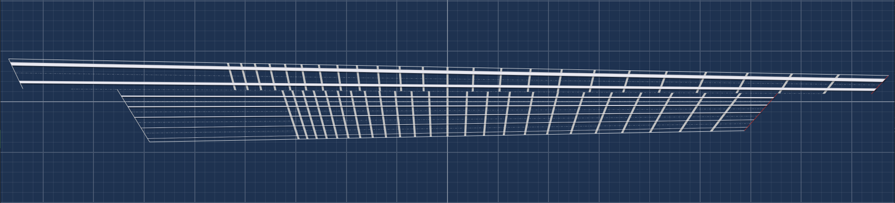

# sigen-next

**This is a complete rewrite of SiGen. For the stable version, see [SiGen Stable Repository](https://github.com/Polymaker/sigen).**

**SiGen** stands for **S**tringed **I**nstrument layout **Gen**erator.

## Overview

SiGen is a modern application for designing and configuring stringed instrument layouts. It provides advanced tools for luthiers and builders to create custom fretboards, string spacings, scale lengths, and more, supporting a wide range of instrument types and tunings.

## Features

- Design electric, acoustic, classical guitars, basses, banjos, mandolins, ukuleles, and custom instruments
- Flexible string spacing and margin presets
- Multiscale and per-string scale length layouts
- Advanced fret calculation and compensation
- Multi-language support
- Intuitive user interface for instrument design

## Preview
Here is a multiscale layout with 2 bass strings and 5 guitar strings:

## Status

This version is under active development and not yet feature-complete. For a stable and production-ready version, please see [SiGen Stable Repository](https://github.com/Polymaker/sigen).

## License

This project is licensed under the MIT License.

---
